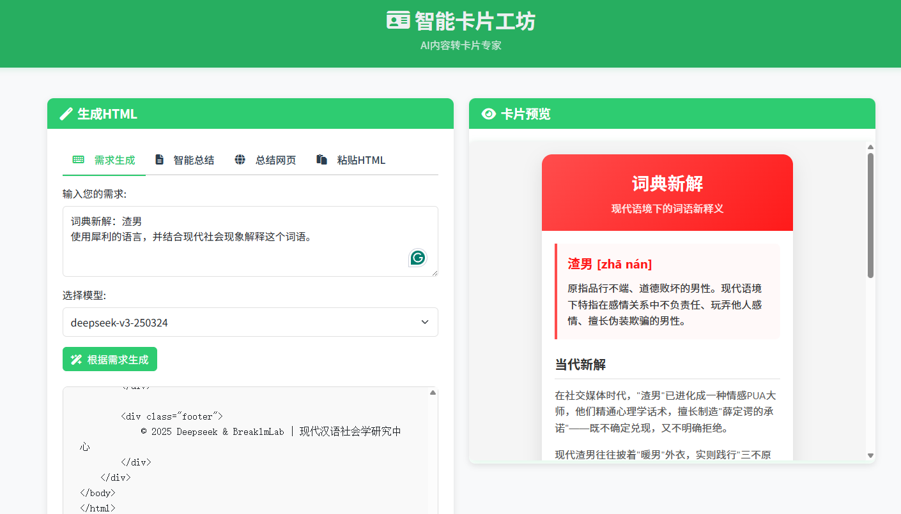
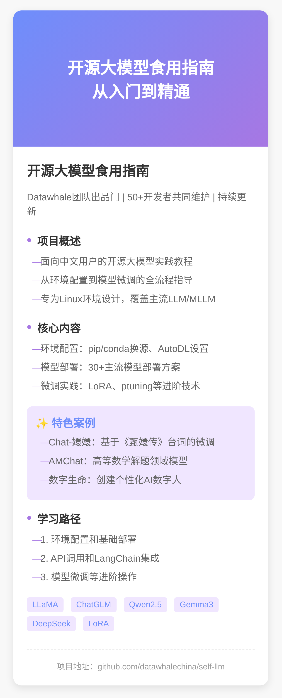
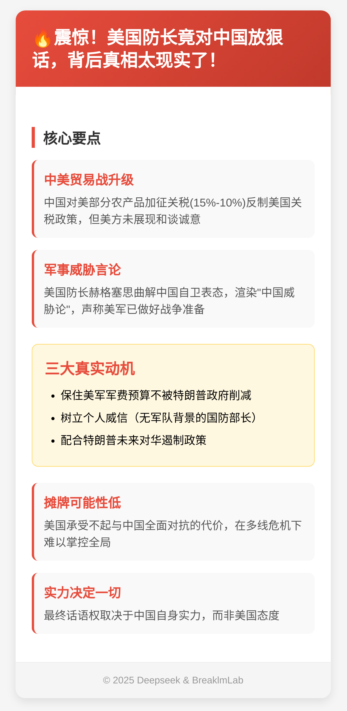
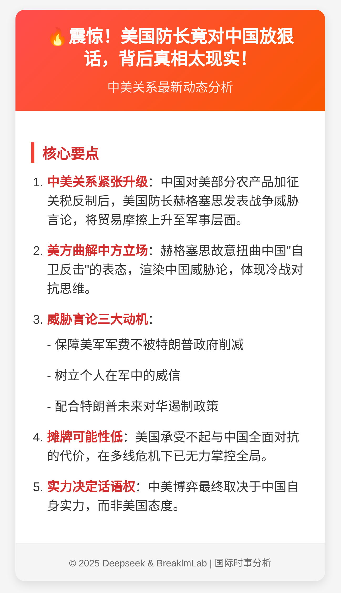
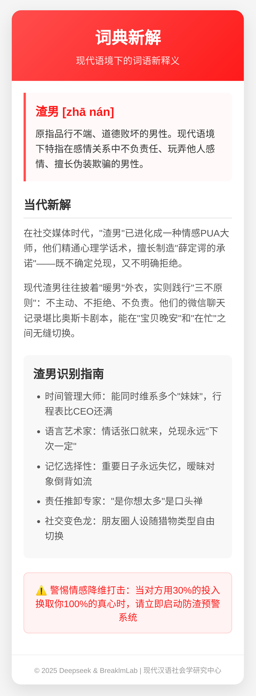

# 智能卡片工坊 (Smart Card Workshop)

一款基于AI的内容转换工具，可以将文本、网页内容或HTML代码转换为精美的卡片图像。



## 应用截图


### 卡片生成效果
<div style="display: flex; flex-wrap: wrap; gap: 10px; justify-content: space-between;">
  
  
  
  
</div>

### 演示视频
[](https://www.bilibili.com/video/BV1kQRSY9EzQ/)

[观看B站演示视频](https://www.bilibili.com/video/BV1kQRSY9EzQ/)

## 功能特点

- **多种输入方式**：
  - 直接输入需求文本，AI自动生成HTML
  - 粘贴已有HTML代码
  - 智能总结长文本内容
  - 抓取并总结网页内容

- **基于AI的内容生成**：
  - 使用先进的大语言模型处理内容
  - 自动提取关键信息生成结构化卡片
  - 支持多种模型选择

- **精美卡片导出**：
  - 生成适合移动设备的HTML卡片
  - 导出为PNG图片格式
  - 实时预览编辑效果

## 技术栈

- **后端**：FastAPI (Python)
- **前端**：Bootstrap 5, JavaScript
- **AI模型**：通过ARK平台接入大语言模型
- **图像处理**：Selenium WebDriver, OpenCV
- **网页抓取**：Jina API

## 安装指南

### 使用uv包管理器安装

[uv](https://github.com/astral-sh/uv) 是一个快速且现代的Python包管理器，推荐使用它来安装项目依赖。

#### 安装uv

```bash
# 使用pip安装uv
pip install uv

# 或者使用pipx安装(推荐)
pipx install uv
```

#### 克隆项目并安装依赖

```bash
# 克隆项目
git clone https://github.com/yourusername/smart-card-workshop.git
cd smart-card-workshop

# 创建虚拟环境并安装依赖
uv venv
uv pip install -r app/requirements.txt
```

### 环境变量配置

在`tools`目录下创建一个`.env`文件，添加以下配置：

```
# ARK平台API密钥
ARK_API_KEY="your_ark_api_key_here"

# Jina API密钥(用于网页抓取)
JINA_API_KEY="your_jina_api_key_here"
```

## 运行应用

```bash
# 激活虚拟环境
# Windows
.venv\Scripts\activate
# Linux/MacOS
source .venv/bin/activate

# 启动应用
cd app
uvicorn main:app --reload
```

然后在浏览器中访问 `http://localhost:8000` 即可使用应用。

## 使用指南

1. **需求生成**：输入您需要的卡片内容描述，AI将生成相应的HTML卡片
2. **智能总结**：输入长文本，自动提取关键信息并生成摘要
3. **总结网页**：输入网页URL，抓取并总结网页内容
4. **粘贴HTML**：直接粘贴您已有的HTML代码生成卡片

## 系统要求

- Python 3.8+
- Google Chrome浏览器 (用于Selenium渲染)
- 网络连接 (用于API调用)

## 许可证

[Creative Commons Attribution-NonCommercial 4.0 International (CC BY-NC 4.0)](https://creativecommons.org/licenses/by-nc/4.0/)

本项目采用CC BY-NC 4.0协议，您可以自由地：
- 共享 — 在任何媒介以任何形式复制、发行本作品
- 演绎 — 修改、转换或以本作品为基础进行创作

惟须遵守下列条件：
- 署名 — 您必须给出适当的署名，提供指向本许可协议的链接，同时标明是否对原始作品作了修改
- 非商业性使用 — 您不得将本作品用于商业目的

详细许可条款请查看[完整法律文本](https://creativecommons.org/licenses/by-nc/4.0/legalcode.zh-Hans)。

## 贡献指南

欢迎贡献代码、报告问题或提供改进建议。请遵循以下步骤：

1. Fork本项目
2. 创建您的特性分支 (`git checkout -b feature/amazing-feature`)
3. 提交您的更改 (`git commit -m '添加一些很棒的功能'`)
4. 将您的更改推送到分支 (`git push origin feature/amazing-feature`)
5. 提交Pull Request

## 联系方式

如有任何问题或建议，请通过以下方式联系我们：

- 邮箱：your.email@example.com
- GitHub Issues：[提交问题](https://github.com/yourusername/smart-card-workshop/issues)
